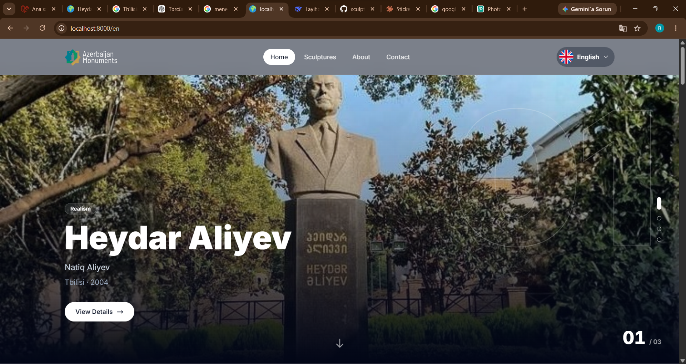
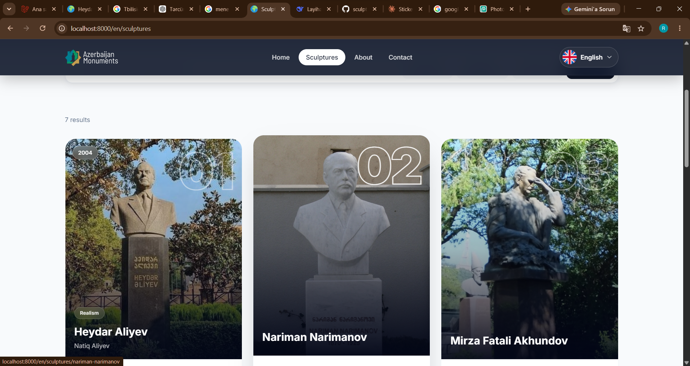
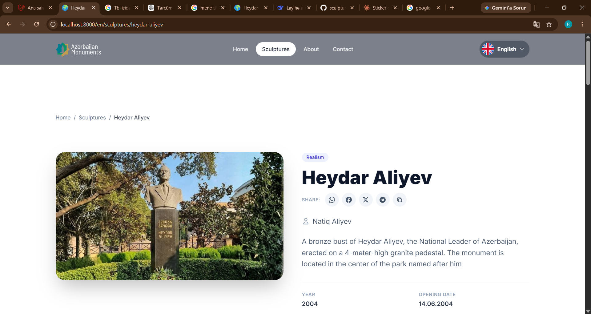
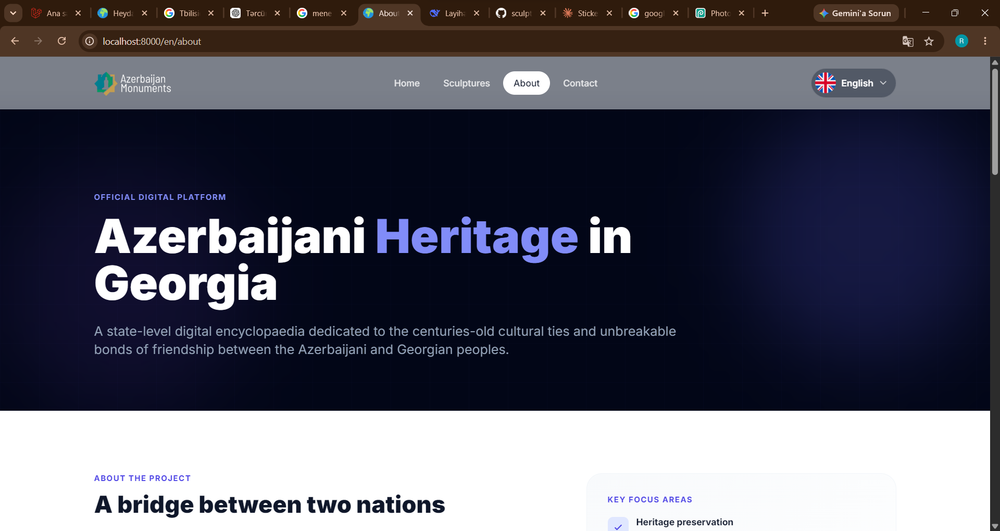
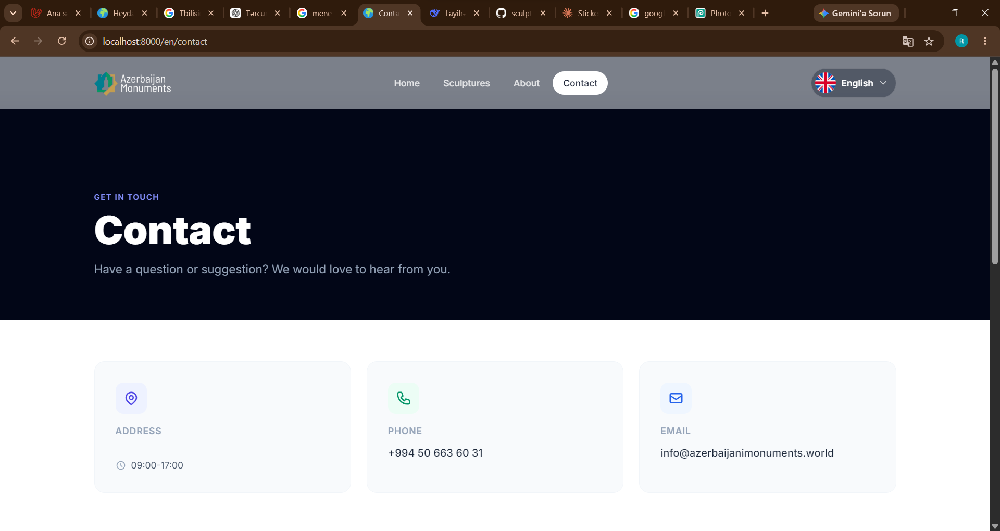

# Azerbaijan Sculptures — Georgia

[](https://github.com/mr-ruhid/sculpture-museum)
[](https://github.com/mr-ruhid/sculpture-museum/blob/main/LICENSE.md)
[](https://laravel.com)

> A multilingual web platform and admin panel for the digital cataloging of monuments, sculptures, and historical objects.

---

## About the Project

**Azerbaijan Sculptures** is a standalone web platform for the digital cataloging of sculptures, monuments, and historical objects in Azerbaijan. The project is a derivative of the [RJ CMS Lite](https://ruhidjavadoff.blogspot.com/2021/03/rj-cms-lite.html) ecosystem and uses the **RJ Museum Theme** on the frontend.

The platform consists of two main parts:

- **Public website**: a sculpture catalog, interactive map, scroll-driven showcase, gallery, and 360° panorama
- **Admin panel**: an interface for managing content, languages, media, SEO, and site settings

---

## Screenshots

<table>
  <tr>
    <td align="center" width="50%">
      <br>
      <sub>Home page: scroll-driven showcase</sub>
    </td>
    <td align="center" width="50%">
      <br>
      <sub>Interactive map</sub>
    </td>
  </tr>
  <tr>
    <td align="center" width="50%">
      <br>
      <sub>Sculpture detail page</sub>
    </td>
    <td align="center" width="50%">
      <br>
      <sub>Admin panel: sculptures</sub>
    </td>
  </tr>
  <tr>
    <td align="center" colspan="2">
      <br>
      <sub>Admin panel: settings</sub>
    </td>
  </tr>
</table>

---

## Key Features

### Public Website

- **Interactive map**: Leaflet + OpenStreetMap (no API key required)
- **Scroll-driven showcase**: presents the latest published sculptures on the home page
- **Lightbox gallery**: full-screen image viewing
- **360° panorama**: Google Maps embed support
- **Short URL system**: permanent links for QR codes (`/q/{code}`)
- **Fully responsive**: optimized for mobile, tablet, and desktop

### Admin Panel

- Multilingual content management
- Image and gallery upload (with WebP conversion)
- 360° panorama management
- SEO settings
- Site settings
- Dynamic language management
- Two-factor authentication (2FA)
- Cache management
- QR short link management (blocking and statistics)

### Multilingual Support

- **4 languages:** Azerbaijani, English, Russian, Georgian
- URL prefixes (`/az/...`, `/en/...`)
- Automatic language selection via the `Accept-Language` header
- Admin panel is available in Azerbaijani only (hardcoded)

### Short URLs and QR Codes

Permanent links designed for QR codes:

- `/{domain}/q/{code}` issues a 301 redirect to `/{locale}/sculptures/{slug}`
- Language is selected automatically based on the browser language
- Managed from the admin panel (blocking and statistics)

---

## Technology Stack

| Category | Technology |
|---|---|
| **Backend** | Laravel 12.x |
| **Frontend** | Blade + Tailwind CSS (CDN), vanilla JavaScript |
| **Map** | Leaflet + OpenStreetMap |
| **Images** | Intervention/Image (WebP) |
| **Database** | MySQL |
| **Web Server** | Apache / Nginx |
| **PHP** | 8.2+ |

---

## Project Structure

### Frontend Theme: `resources/views/theme/rjmuseum/`

```text
theme/rjmuseum/
├── layouts/
│   └── app.blade.php               # Main layout (header, footer, meta)
├── widgets/
│   ├── header.blade.php            # Dark glass header + language switcher
│   ├── footer.blade.php            # Footer with social media icons
│   ├── scroll-showcase.blade.php   # Scroll-driven sculpture showcase
│   ├── map.blade.php               # Leaflet map + list panel
│   └── sculpture-card.blade.php    # Sculpture card
├── pages/
│   ├── home.blade.php              # Home page
│   ├── sculptures.blade.php        # Sculpture catalog (with filters)
│   ├── sculpture.blade.php         # Sculpture detail page
│   ├── panorama.blade.php          # Full-screen 360° page
│   ├── about.blade.php             # About page
│   ├── contact.blade.php           # Contact page
│   ├── _dynamic.blade.php          # Dynamic page renderer
│   └── templates/                  # Custom template pages
├── css/
│   └── app.css                     # Custom styles (glass, showcase)
└── js/
    └── app.js                      # Showcase, language switcher, ripple effect
```

**Full source:** [resources/views/theme/rjmuseum](https://github.com/mr-ruhid/sculpture-museum/tree/main/resources/views/theme/rjmuseum)

### Admin Panel: `resources/views/admin/`

```text
admin/
├── layouts/
│   └── app.blade.php               # Admin layout (header, navigation)
├── auth/
│   ├── login.blade.php             # Login page
│   └── twofactor.blade.php         # 2FA verification page
├── sculptures/
│   ├── index.blade.php             # Sculpture list (drag & drop ordering)
│   ├── create.blade.php            # New sculpture
│   └── edit.blade.php              # Edit sculpture
├── pages/
│   ├── index.blade.php             # Pages
│   ├── create.blade.php            # New page
│   └── edit.blade.php              # Edit page
├── settings/
│   ├── index.blade.php             # Settings hub
│   ├── general.blade.php           # General
│   ├── contact.blade.php           # Contact
│   ├── social.blade.php            # Social
│   ├── seo.blade.php               # SEO
│   ├── homepage.blade.php          # Home page
│   ├── smtp.blade.php              # SMTP
│   └── about.blade.php             # About
├── short-urls/
│   └── index.blade.php             # Short URLs (create, edit, delete)
├── security/
│   └── blocked-ips.blade.php       # Blocked IPs
├── languages/
│   └── index.blade.php             # Languages
├── profile/
│   └── index.blade.php             # Profile (password, 2FA)
└── cache/
    └── index.blade.php             # Cache management
```

**Full source:** [resources/views/admin](https://github.com/mr-ruhid/sculpture-museum/tree/main/resources/views/admin)

---

## Installation

```bash
# 1. Clone the repository
git clone https://github.com/mr-ruhid/sculpture-museum.git
cd sculpture-museum

# 2. Install dependencies
composer install

# 3. Prepare the environment file
cp .env.example .env
php artisan key:generate

# 4. Configure the database in .env, then run the migrations
php artisan migrate

# 5. Create the storage symlink
php artisan storage:link

# 6. Start the application
php artisan serve
```

The application will be available at `http://127.0.0.1:8000`.

---

## RJ CMS Documentation

More information about the RJ CMS ecosystem:

- [RJ CMS Systems](https://github.com/mr-ruhid)
- [RJ CMS Derivative Sites](https://github.com/mr-ruhid)
- [RJ CMS Lite](https://ruhidjavadoff.blogspot.com/2021/03/rj-cms-lite.html)
- [RJ Theme](https://github.com/mr-ruhid)
- [RJ AI Agent — Agsaggal AI](https://github.com/mr-ruhid)

---

## License

This project is a derivative of RJ CMS Lite and is protected by a proprietary license. For usage terms, see [LICENSE.md](LICENSE.md).

**Summary:**

- **Permitted:** viewing, reading, and studying the code for personal, non-commercial purposes
- **Not permitted:** copying, distributing, or using the code in production without written permission
- **Not permitted:** modifying it or creating derivative works (except for private study)
- **Note:** contact the author for commercial or production use

---

## Support the Project

If this project has been useful to you, consider supporting its continued development and maintenance.

<div align="center">

<a href="https://kofe.al/@ruhidjavadoff">
  
</a>
&nbsp;&nbsp;
<a href="https://www.paypal.com/paypalme/ruhidjavadoff">
  
</a>

</div>

<br>

| Method | Details |
|---|---|
| Kofe.al | [@ruhidjavadoff](https://kofe.al/@ruhidjavadoff) |
| Çayvoy | [ruhid4715](https://cayvoy.com/donate/ruhid4715) |
| PayPal | `ruhidjavadoff@gmail.com` |
| Crypto (USDT — BNB Smart Chain) | `0x9a4AD41762D6B07B8C266b312Cf0dBe31FAd890c` |

---

## Author

**Ruhid Javadov**

- GitHub: [@mr-ruhid](https://github.com/mr-ruhid)
- Project: [sculpture-museum](https://github.com/mr-ruhid/sculpture-museum)

---

<div align="center">

**Azerbaijan Sculptures** · Built with RJ CMS Lite · © 2026

</div>
